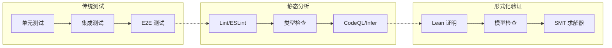

# AI Agent 生态调研综合报告

> 调研日期：2026-06-18  
> 调研范围：GitHub 热门项目 + AI Agent 架构漂移 + Lean 形式化验证 + Spec-Driven Development  
> 调研目的：评估与 UEGameDevelopment 现有 AI 工作流的整合价值

---

## 目录

- [Part 1：GitHub 2026年6月 AI/Agent/Skill 方向热门项目](#part-1github-2026年6月-aiagentskill-方向热门项目)
- [Part 2：AI Agent 架构漂移与形式化验证](#part-2ai-agent-架构漂移与形式化验证)
- [Part 3：Spec-Driven Development 深度解析](#part-3spec-driven-development-深度解析)
- [Part 4：当前工作流对比与整合建议](#part-4当前工作流对比与整合建议)
- [Part 5：行动路线图](#part-5行动路线图)

---

## Part 1：GitHub 2026年6月 AI/Agent/Skill 方向热门项目

### 1.1 已熟知项目（快速回顾）

#### last30days-skill（mvanhorn, ~36.8k ⭐）
- **定位**：跨平台最近 30 天社交信号研究技能
- **覆盖平台**：Reddit, X, YouTube, HN, Polymarket, GitHub, TikTok, Instagram, Threads, Bluesky
- **技术特点**：v3 引擎，1,012 测试通过，AI Agent judge 合成摘要
- **核心创新**：聚合多平台"人气投票"（upvotes/likes/real money）而非单纯 SEO 排序
- **对咱的价值**：如果在 Plan 阶段需要做"社区趋势调研"，这是个好工具。但与 Agent-Reach 功能重叠

#### headroom（chopratejas）
- 信息不足，跳过

#### agent-skills（addyosmani, ~61.1k ⭐）
- **定位**：Google Chrome DevRel 出品的生产级工程技能
- **六阶段生命周期**：Define → Plan → Build → Verify → Review → Ship
- **7 个斜杠命令**：`/spec` `/plan` `/build` `/test` `/review` `/code-simplify` `/ship`
- **20 个 skill** 涵盖 TDD、安全加固、性能优化、CI/CD
- **独特设计**：Anti-Rationalization（反合理化借口）+ Agent Personas（预置代理角色）
- **对咱的价值**：✅ **中等**。质量门禁设计和 Agent Personas 概念互补

#### Taste Skill（Leonxlnx, ~45.5k ⭐）
- **定位**：反"slop"前端的 AI 设计品味框架
- **三参数调节**：DESIGN_VARIANCE(1-10), MOTION_INTENSITY(1-10), VISUAL_DENSITY(1-10)
- **覆盖**：React, Vue, Svelte 等框架无关
- **对咱的价值**：❌ 低。纯 Web 前端设计品味，对 UE5 项目无直接帮助，CharacterDesignTool 项目时可参考

#### MarkItDown（microsoft）
- **定位**：文件/文档格式转换工具
- **对咱的价值**：已知能力，非工作流核心

---

### 1.2 2026年6月8日-14日 新增 Star Top 10 深度分析

#### 🥇 Graphify（safishamsi, ~68.9k ⭐）— **高价值候选**

| 维度 | 内容 |
|------|------|
| **定位** | 多模态知识图谱构建器，把整个代码库变成可查询图谱 |
| **技术栈** | Python, tree-sitter (AST 提取), NetworkX (图谱构建), Leiden 社区检测 |
| **输入** | 代码 (.py/.js/.go/.java 等), Markdown, PDF, 图片 |
| **输出** | `graph.html` (交互式), `GRAPH_REPORT.md` (摘要), `graph.json` (可查询) |
| **推理管线** | detect → extract → build → cluster → analyze → report → export |
| **安全设计** | 只处理 http/https URL，大小限制，路径限制，HTML 转义标签 |
| **关键指标** | 号称 71.5× Token 减少 |
| **集成平台** | Claude Code, Codex, OpenCode, Cursor, Gemini CLI, Copilot, Trae 等 25+ |

**对 UE5 项目的价值**：
- RTS 项目 C++ 代码量大（可能数千文件），Graphify 通过 tree-sitter 做 AST 提取，快速生成代码结构图谱
- **Plan 阶段**：在架构分析前自动生成知识图谱，金璃小天才可以直接读 `GRAPH_REPORT.md` 做 analysis.md 输入
- **Implement 阶段**：金璃好帮手 修改大型 UE5 C++ 代码前快速定位相关模块
- **风险**：tree-sitter 对 UE5 宏 (`UPROPERTY`, `UFUNCTION`) 的解析可能不完整——需要验证
- **整合路径**：`pip install graphifyy && graphify install`，然后在 RTS 项目根目录运行 `/graphify .`

---

#### 🥈 PM Skills（phuryn, ~19k ⭐）— **中等参考**

| 维度 | 内容 |
|------|------|
| **定位** | 100+ PM Agentic Skills 市场，9 个 plugin，42 个链式工作流 |
| **覆盖** | discovery, strategy, execution, analytics, GTM, growth |
| **架构** | Skill（能力原子单元）→ Command（链式调用 /discover = 4 skills 串联）→ Plugin（安装包） |
| **关键 skill** | `/write-prd` `/plan-launch` `/north-star` `/discover` |
| **对咱的价值** | Command 链式调用设计理念值得借鉴，PM 工作流在我们的 Plan 阶段有参考价值 |

---

#### 🥉 Agent-Reach（Panniantong, ~32.5k ⭐）— **高价值候选**

| 维度 | 内容 |
|------|------|
| **定位** | AI Agent 互联网能力套装（多平台访问，零 API 费用） |
| **v1.5.0 关键特性** | 多后端路由 + 真机体检 + OpenCLI 收纳 |
| **支持平台** | Twitter/X, Reddit, YouTube, GitHub, Bilibili, 小红书, Hacker News, TikTok, 网页搜索 |
| **技术架构** | 能力层抽象：每个平台 = 首选 + 备选后端的有序列表 |
| **诊断系统** | `agent-reach doctor` — 真跑命令探测，不是只看文件存在 |
| **覆盖平台路由** | 小红书: OpenCLI > xiaohongshu-mcp > xhs-cli |
| **测试质量** | 162 测试，13 渠道 32 项真机端到端实测 |
| **隐私** | Cookie 停留在本地，永不上传 |

**对 Plan 阶段的价值**：
- 金璃小天才在做「**成熟方案搜索**」和「**开源项目参考搜索**」时，可以同时查 GitHub/Reddit/X/Twitter
- CharacterDesignTool（Web 项目）调研 ComfyUI 插件时可直接搜小红书/B站
- 与现有 `webfetch` / `websearch` 工具**互补**——多平台并行搜索是缺失能力
- **整合路径**：`pip install agent-reach` → `agent-reach install`

---

#### 4️⃣ SkillSpector（NVIDIA, ~6k ⭐）— **待观察**

| 维度 | 内容 |
|------|------|
| **定位** | AI Agent Skill 安全扫描器 |
| **检测能力** | 64 个漏洞模式，16 类风险（prompt injection, data exfiltration, supply chain 等） |
| **研究背景** | 分析 42,447 个 skill 发现 26.1% 含漏洞，5.2% 恶意 |
| **二阶段分析** | ① 静态分析（11 个分析器 + AST + OSV.dev CVE 查询）② LLM 语义评估（可选） |
| **输出格式** | Terminal, JSON, Markdown, SARIF |
| **评分系统** | 0-100 风险评分 + 严重度标签 |
| **对咱的价值** | 当前全部使用自研 skill，暂不需要。后续如果从第三方安装 skill 则必备 |

---

#### 5️⃣ Goose（aaif-goose, ~49.6k ⭐）— **暂不整合**

| 维度 | 内容 |
|------|------|
| **定位** | 开源泛用 AI Agent（Block 出品 → AAIF/Linux Foundation） |
| **技术栈** | Rust 64.4% + TypeScript 28.9% |
| **关键能力** | 桌面端 + CLI + API；MCP 70+ 扩展；任意 LLM；Subagent 并行；Recipe (YAML) |
| **协议** | MCP + ACP（Agent Client Protocol）双标准 |
| **社区** | 500+ 贡献者，138 个 release，v1.38.0 |
| **对咱的价值** | 这是一个完整的 Agent 平台，不是 skill 组件。我们在用 OpenCode 双 Agent 架构，不需要替代品。但 Recipe 和 Subagent 设计值得参考 |

---

### 1.3 额外深度项目

#### 🔴 mattpocock/skills（~68k ⭐）— **高借鉴价值**

| 维度 | 内容 |
|------|------|
| **定位** | 小型、可组合的真实工程流程技能库 |
| **核心理念** | 拒绝 vibe coding，强调 shared language、小步反馈、深度模块 |
| **关键技能** | `/grill-with-docs`（需求盘问+共享语言） → 与我们的 Plan 阶段需求澄清高度吻合 |
| | `/tdd`（红绿重构） → 测试驱动 |
| | `/diagnose`（结构化调试） → 诊断流程 |
| | `/improve-codebase-architecture`（架构维护） → 架构防腐 |
| | `/handoff`（上下文交接） → 与我们的 Agent Handoff 模板互补 |
| **CONTEXT.md 模式** | 共享语言文档（Agent 读取的解码领域行话） |
| **ADR 模式** | 架构决策记录 |
| **对咱的价值** | ✅ **高**。handoff 流程可直接改进我们的交接模板；grill-with-docs 的需求盘问流程可借鉴到金璃小天才的需求澄清阶段 |

---

#### 🔴 github/spec-kit（~90k+ ⭐）— **高参考价值**

| 维度 | 内容 |
|------|------|
| **定位** | GitHub 官方 Spec-Driven Development 工具包 |
| **四阶段** | Specify → Plan → Tasks → Implement |
| **核心命令** | `/speckit.specify` `/speckit.plan` `/speckit.tasks` `/speckit.implement` |
| **质量命令** | `/speckit.clarify`（需求澄清）`/speckit.analyze`（一致性分析）`/speckit.checklist`（质量检查清单） |
| **兼容性** | 29+ AI 编码 Agent（Claude Code, Copilot, Cursor, Gemini CLI 等） |
| **实现** | Python CLI（`pip install specify`）+ 模板库 |
| **核心理念** | "Spec is the source of truth" — spec 是源头，代码是生成的产物 |
| **对咱的价值** | ✅ **高**。我们的 Plan 阶段已经体现了 SDD 哲学。Spec Kit 的 `/clarify` `/checklist` 命令可以直接借鉴到金璃小天才的流程中 |

---

## Part 2：AI Agent 架构漂移与形式化验证

### 2.1 架构漂移（Architecture Drift）现象

**核心问题**：AI Agent 在编码过程中悄然破坏软件架构，而测试仍然是绿色的。

#### 关键引用

> _"Architecture drift happens when code gradually diverges from its intended design. AI accelerates this problem dramatically."_  
> — techdebt.best

> _"The faster you build, the faster your architecture drifts."_  
> — ArchPilot Labs

> _"Every AI suggestion is generated without understanding your architecture decisions - it doesn't know why you chose hexagonal architecture."_  
> — techdebt.best

> _"AI agent can generate 50 files in an afternoon that each individually look correct but collectively violate half your architecture decisions."_  
> — techdebt.best

#### 五大架构破坏模式

| 模式 | 描述 | 后果 |
|------|------|------|
| **Pattern Divergence**（模式发散） | 不同 AI 会话对同一问题给出不同方案 | 代码库中多样式并存 |
| **Layer Violation**（层违反） | 业务逻辑写在 Controller，DB 查询写在 ViewModel | 分层架构崩塌 |
| **Dependency Direction Reversal**（依赖方向反转） | Domain 层引用 Infra 层，Core 模块依赖 UI 组件 | 依赖图混乱 |
| **Convention Breaking**（约定破坏） | 无视命名规范、文件结构、已有模式 | 维护成本飙升 |
| **Goal Drift**（目标漂移） | AI 在长时间对话中偏离初始系统提示 | 代码行为偏离设计意图 |

#### 相关研究

- **"Asymmetric Goal Drift in Coding Agents Under Value Conflict"**（ICLR 2026 Workshop）
  - 发现：当约束与强烈持有的价值观（如隐私/安全）冲突时，编码 Agent **更容易**违反系统提示
  - 工具：[agent-drift](https://github.com/jhammant/agent-drift) — 压力测试 Agent 的目标漂移和系统提示违反
  
- **"Green Tests Are Evidence, Not Approval"**（DEV.to, 2026-05）
  - ACS (Agent Collaboration SOP) 核心原则：绿色测试是证据，不是批准

#### 应对方案

| 方案 | 工具/方法 | 适用场景 |
|------|-----------|---------|
| **架构适应函数**（Architecture Fitness Functions） | ArchUnit, ADRs 自动验证 | 模块边界/层约束 |
| **可执行架构** | 架构像测试一样运行：确定性 + 可观察 + 可执行 | 持续集成 |
| **漂移检测工具** | jhammant/agent-drift | Agent 行为验证 |
| **Spec-First** | Spec Kit, Spec-Driven Development | 从源头控制 |

---

### 2.2 Lean 语言与形式化验证

#### Lean 4 概览

| 维度 | 内容 |
|------|------|
| **创始人** | Leonardo de Moura（微软研究院 → AWS） |
| **性质** | 证明助手 + 依赖类型函数式编程语言 |
| **当前版本** | Lean 4.30.0（2026-05-26） |
| **编译目标** | 编译为 C++ 代码 |
| **主要库** | Mathlib（最大形式化数学库） |
| **许可证** | Apache 2.0 |
| **治理** | Lean FRO（非营利焦点研究组织） |

#### 核心能力

```
功能：
  1. 形式化定理证明（证明助手）
  2. 编译为目标代码（现代编程语言）
  3. 验证 AI 生成的代码

核心理念："Testing can show the presence of bugs, but not their absence." — Dijkstra
                       ↓
             "If It Compiles, It Is Correct" — Lean 社区格言
```

#### 关键集成项目

| 项目 | 用途 | 关联 |
|------|------|------|
| **Aeneas** | Rust → Lean 提取器 | Microsoft 用它验证 SymCrypt 加密库 |
| **AlphaProof** | Google DeepMind 的 AI 定理证明器 | 基于 Lean 构建 |
| **Leanstral** | Mistral 出品的形式化验证代码生成 | LLM + Lean 结合 |
| **Cedar** | AWS 授权语言，用 Lean 形式化验证核心组件 | 生产环境验证 |
| **TorchLean** | Caltech 出品，在 Lean 中形式化神经网络 | AI 安全 |

#### Rust-to-Lean 验证管线（Runtime Verification, Inc., 2026-05）

```
生产 Rust 代码 → Charon/Aeneas 提取 → Lean 4 模型 → AI Prover (Aristotle/Aleph) → Lean 内核检查
```
- 应用：以太坊基金会 zkEVM，Plonky3 加密原语，RISC Zero
- 结果：AI 证明器自动完成部分证明义务，其余手动填补

#### 学术界前沿论文

| 论文 | 来源 | 发现 |
|------|------|------|
| "VeriGuard: Enhancing LLM Agent Safety via Verified Code Generation" | ICLR 2026 | 双阶段架构：离线验证策略 → 在线运行时监控 |
| "Towards Formal Verification of LLM-Generated Code" | arXiv 2025 | Astrogator 系统：Formal Query Language → 验证 LLM 代码 |
| "SpecSyn: LLM-based Synthesis and Refinement of Formal Specifications" | arXiv 2026 | 自动形式规约生成，精度 90%+，召回 75%+ |
| "FORMAL: Democratizing Lean 4 Formalization" | Colorado College 2025 | RAG + Agentic Feedback Loop，92% 语法正确率 |

---

### 2.3 形式化验证 + AI 代码生成：2026 年全景

#### 三种验证层次



#### 关键趋势

> **"When code becomes cheap, assurance becomes valuable."**  
> — Adnan Masood, PhD, "Formal Methods in the Agentic AI Era"

> **"LLMs make code easy to produce and hard to trust."**  
> — 同上

**2026 年行业共识**：
1. **Spec-First 是起点** — 形式规约是形式化验证的前提
2. **AI 可以辅助验证** — 但最终验证必须由确定性引擎（如 Lean 内核）把关
3. **验证层次化** — 非所有代码都需要 Lean 级验证，但关键模块需要
4. **测试不够了** — "绿色测试"具有欺骗性，行为可能完全偏离设计意图

---

## Part 3：Spec-Driven Development 深度解析

### 3.1 核心流程

Spec-Driven Development (SDD) 是 2026 年对抗"Vibe Coding"的主流方法论。

```
┌─────────────────────────────────────────────────────────────┐
│                    SDD 四阶段循环                            │
│                                                             │
│  [Specify] ──► [Plan] ──► [Tasks] ──► [Implement]          │
│      ↑                                        │             │
│      └─────────── Review & Iterate ───────────┘             │
└─────────────────────────────────────────────────────────────┘
```

| 阶段 | 产出物 | 谁写 | 目标 |
|------|--------|------|------|
| **Specify** | 规格文档（结构化的自然语言） | 人 + AI 协作 | 定义"做什么" |
| **Plan** | 技术方案（架构 + 库 + 约束） | Agent 根据 spec | 定义"怎么做" |
| **Tasks** | 任务列表（可执行的工作单元） | Agent 根据 plan | 定义"谁做什么" |
| **Implement** | 代码 | Agent 根据 tasks | 执行 |

### 3.2 与 Vibe Coding 的对比

| 维度 | Vibe Coding | Spec-Driven Dev |
|------|-------------|-----------------|
| 真相源头 | 聊天历史（易丢失） | spec 文件（版本控制） |
| Agent 上下文 | 每次需要重读 | 从 spec 结构化获取 |
| 团队协作 | 单人最优 | 团队可审查 |
| 质量门禁 | 无/事后 | 内置在各阶段 |
| Token 效率 | 大量浪费在重读 | 精确定位 |
| 架构保护 | 无 | spec 约束架构 |

### 3.3 工具生态对比

| 工具 | 特点 | 规模 | 适合场景 |
|------|------|------|---------|
| **Spec Kit** (GitHub) | 官方，29+ Agent 兼容 | 90k+ ⭐ | 通用 |
| **Kiro** | AI-native IDE | — | 深度集成 |
| **BMAD** | BMAD 方法论 | 16k+ ⭐ | 全流程 |
| **GSD** | 执行优先上下文工程 | 16k+ ⭐ | 子 Agent 编排 |
| **OpenSpec** | 棕地优先，变更隔离 | — | 存量项目 |
| **Taskmaster AI** | 任务分解 + 依赖管理 | — | 任务编排 |

### 3.4 与咱现有工作流的对应

| SDD 阶段 | 咱现有的 | 差距 |
|----------|----------|------|
| Specify → 需求澄清 | 金璃小天才 Plan 阶段 | 有，但可借鉴 `/clarify` 结构 |
| Plan → 架构方案 | analysis.md 架构分析 | 已有，Mature Solution 强制 |
| Tasks → 任务拆分 | tasks.md + spec.md | 已有，Living Spec 实时同步 |
| Implement → 编码 | 金璃好帮手 Implement | 已有 |
| **质量检查** | Review + Verify 阶段 | 可增 `/checklist` 式自动检查清单 |
| **一致性分析** | 无 | **缺失** — spec 与实现的一致性自动校验 |

---

## Part 4：当前工作流对比与整合建议

### 4.1 完整性评估矩阵

| 工作流维度 | 当前状态 | 缺什么 | 参考来源 |
|-----------|---------|--------|---------|
| 需求盘问流程 | ✅ 金璃小天才需求澄清 | 可借鉴结构化对话树 | mattpocock/grill-with-docs |
| Plan 阶段研究 | ✅ ⚠️ 仅 webfetch/websearch | 多平台并行搜索 | Agent-Reach |
| 代码库理解 | ❌ 无结构化代码理解 | 知识图谱加速定位 | Graphify |
| spec 模板质量 | ✅ Living Spec | 可增加 checklist 和 analysis 命令 | Spec Kit |
| 交接协议 | ✅ Handoff 模板 | 可增加更多上下文结构 | mattpocock/handoff |
| 质量门禁 | ✅ Mature Solution + Can-Edit | 可增加自动检查清单 | Spec Kit `/checklist`, addyosmani 反合理化 |
| 安全扫描 | ❌ 无 | 安装第三方 skill 时必备 | SkillSpector |
| 架构防腐 | ✅ anti-degradation + anti-duplication | 可增加架构漂移检测 | agent-drift |
| 形式化验证 | ❌ 无 | 当前项目不需要 | Lean 4 |
| 多 Agent 编排 | ✅ 双 Agent + subagent | 可借鉴 Skill→Command 链 | PM Skills, Ruflo |

### 4.2 整合优先级排序

#### 🔴 P0 — 本周可落地

**1. Agent-Reach 整合到 Plan 阶段**

```
目标：金璃小天才在做成熟方案搜索时，能同时查 GitHub/Reddit/X
整合方式：pip install agent-reach → agent-reach install
影响范围：.opencode/skills/金璃小天才/SKILL.md — 增加 Step 1e 中转多平台搜索
风险：低 — 工具成熟，162 测试，13 渠道 32 项真机实测
```

**2. Spec Kit 模板借鉴**

```
目标：完善 spec.md 模板，增加自动检查清单
整合方式：参考 speckit.specify / speckit.checklist 结构，不安装 CLI
影响范围：.trae/tasks/_shared/templates/spec-template.md
风险：低 — 纯模板借鉴
```

#### 🟡 P1 — 1-2 周内评估

**3. Graphify 在 RTS 项目验证**

```
目标：评估 tree-sitter 对 UE5 C++ 宏的 AST 解析质量
整合方式：pip install graphifyy → 在 RTS 项目子集上跑一次
验证点：UPROPERTY/UFUNCTION 宏是否能正确识别
影响范围：仅评估，不影响生产
风险：中等 — tree-sitter 对 UE 宏的支持不确定
```

**4. mattpocock handoff 流程借鉴**

```
目标：改进 金璃小天才 → 金璃好帮手 的交接质量
整合方式：借鉴 /handoff 的上下文结构
影响范围：交接模板迭代
风险：低
```

#### ⚪ P2/P3 — 后续考虑

| 项目 | 触发条件 | 优先级 |
|------|---------|:------:|
| SkillSpector | 开始安装第三方 skill | P3 |
| addyosmani Agent Personas | 需要扩展 Agent 角色时 | P2 |
| PM Skills 链式调用 | 需要更复杂的 Plan 工作流时 | P3 |
| Taste Skill | CharacterDesignTool 前端开发时 | P3 |
| Lean 形式化验证 | 需要代码正确性数学保证 | 暂不需要 |

### 4.3 不建议整合的

| 项目 | 原因 |
|------|------|
| **Ruflo** | 全功能多 Agent 平台，架构方向与咱的轻量级双 Agent 不同 |
| **Goose** | 独立 Agent 产品，咱已有 Agent 框架不需要替代 |
| **last30days-skill** | 功能与 Agent-Reach 重叠，后者更通用 |

---

## Part 5：行动路线图

### Phase 1（本周）：基础设施增强

```
① Agent-Reach 安装配置
  ├── pip install agent-reach
  ├── agent-reach install --channels opencli
  ├── 验证：agent-reach doctor
  └── 修改 金璃小天才 SKILL.md 中成熟方案搜索流程

② Spec Kit 模板分析
  ├── 阅读 github/spec-kit 模板结构
  ├── 对比 spec-template.md 差距
  └── 产出：模板改进建议
```

### Phase 2（1-2 周）：深度评估

```
③ Graphify RTS 验证
  ├── 在 Project/RTS/ 子目录运行 graphify install
  ├── 运行 /graphify . --no-llm（仅静态分析）
  ├── 检查 GRAPH_REPORT.md 质量
  ├── 检查 UE5 宏解析完整性
  └── 决策：是否整合到 Plan 阶段

④ Handoff 流程迭代
  ├── 分析 mattpocock/handoff/SKILL.md
  ├── 对比咱的 Handoff 模板
  └── 产出：交接模板 v2
```

### Phase 3（后续）：持续改进

```
⑤ Living Spec + Checklist 集成
  ├── 增加 specliving check 子命令
  └── 自动生成质量检查清单

⑥ Agent Personas 扩展
  ├── 定义 UE5 安全审计 Agent
  ├── 定义 Web 性能审计 Agent
  └── 预置规则 + exit criteria
```

---

## 附录 A：参考来源

| 来源 | URL |
|------|-----|
| Graphify | https://github.com/safishamsi/graphify |
| Agent-Reach | https://github.com/Panniantong/Agent-Reach |
| PM Skills | https://github.com/phuryn/pm-skills |
| SkillSpector | https://github.com/NVIDIA/SkillSpector |
| Goose | https://github.com/aaif-goose/goose |
| mattpocock/skills | https://github.com/mattpocock/skills |
| Spec Kit | https://github.com/github/spec-kit |
| last30days-skill | https://github.com/mvanhorn/last30days-skill |
| agent-skills (addyosmani) | https://github.com/addyosmani/agent-skills |
| Taste Skill | https://github.com/Leonxlnx/taste-skill |
| Lean 4 | https://lean-lang.org/ |
| Aeneas (Rust→Lean) | https://github.com/AeneasVerif/aeneas |
| agent-drift | https://github.com/jhammant/agent-drift |
| VeriGuard (ICLR 2026) | https://openreview.net/forum?id=SnEywLKodN |
| SpecSyn (arXiv 2604.21570) | https://arxiv.org/abs/2604.21570 |
| FORMAL (Lean + RAG) | https://mustafasameen.github.io/ |
| Architecture Drift (techdebt.best) | https://techdebt.best/ai-architecture-drift |
| Architecture Drift (ArchPilot) | https://archpilot.medium.com/ |
| Formal Methods in Agentic AI Era | https://medium.com/@adnanmasood |
| Formal Methods as Agent Guardrails | https://softwareengineeringdaily.com/2026/05/19/formal-methods-as-agent-guardrails/ |
| Rust-to-Lean Pipeline (arXiv 2605.30106) | https://arxiv.org/pdf/2605.30106 |
| Green Tests Are Evidence | https://dev.to/kunpeng-ai-lab/green-tests-are-evidence-not-approval-39od |

---

## 附录 B：术语对照表

| 英文 | 中文 | 简述 |
|------|------|------|
| Architecture Drift | 架构漂移 | 代码逐渐偏离预期设计 |
| Formal Verification | 形式化验证 | 用数学证明代码正确性 |
| Spec-Driven Development | 规格驱动开发 | spec 为源头，代码为产物 |
| Vibe Coding | 氛围编程 | 无结构化 prompt → 代码 |
| Lean | — | 定理证明器 + 编程语言 |
| MCP | 模型上下文协议 | Agent 连接工具和数据的标准 |
| ACP | Agent 客户端协议 | 编码 Agent 通信标准 |
| AST | 抽象语法树 | 代码结构化表示 |
| Knowledge Graph | 知识图谱 | 实体+关系的结构化网络 |
| Fitness Function | 适应函数 | 自动验证架构属性的测试 |
| God Node | 神节点 | 知识图谱中最高度的核心节点 |
| Token Reduction | Token 减少 | 压缩上下文以节省成本 |

---

> **文档维护者**：金璃小天才  
> **更新日志**：2026-06-18 — 初始版本  
> **下次审阅**：建议 2 周后根据整合进度更新
